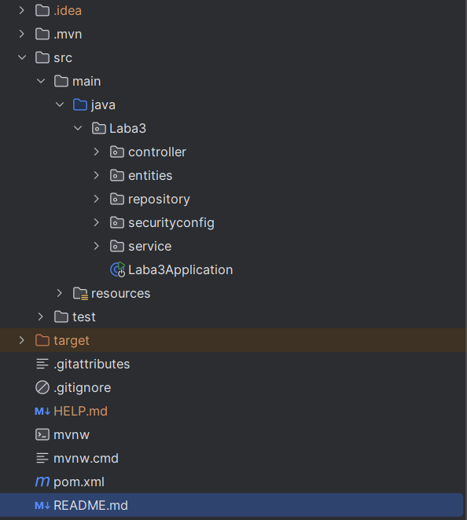

# Project: Department Management System

## Overview
The **Department Management System** is a Java-based application designed to manage departments, workers, and users within an organization. It uses the Hibernate ORM for database interaction and ensures data integrity with custom constraints and validations.

## Features
- Manage **departments** with detailed attributes such as codes, names, email addresses, and phone numbers.
- Manage **workers**, including their assignment to departments and tracking their employment start and end dates.
- Manage **users** with roles and access controls.
- Enforce strict validation rules to ensure data consistency and correctness.

## Technologies Used
- **Java 17**
- **Hibernate ORM** (for database interaction)
- **Jakarta Persistence API**
- **Lombok** (for boilerplate code reduction)
- **Spring Framework** (optional, if integrated for web or API development)
- **MySQL** (or any other relational database)
- **Maven** (for dependency management)

## Project Structure


## Entity Descriptions

### 1. Department
Represents a department within the organization.
- **Fields**:
    - `id`: Unique identifier (auto-generated).
    - `codeDep`: A 3-digit unique code for the department.
    - `nameDep`: Full name of the department.
    - `nameSDep`: Short name (abbreviation).
    - `emailHead`: Email address of the department head.
    - `phoneHead`: Phone number of the department head.
    - `active`: Indicates whether the department is active.

### 2. Worker
Represents an employee assigned to a department.
- **Fields**:
    - `id`: Unique identifier (auto-generated).
    - `code`: Unique worker code.
    - `nameFirst`: First name of the worker.
    - `nameSecond`: Last name of the worker.
    - `startWork`: Start date of employment.
    - `endWork`: End date of employment (optional).
    - `department`: Reference to the associated department.
    - `active`: Indicates whether the worker is currently active.

### 3. User
Represents system users for authentication and role management.
- **Fields**:
    - `id`: Unique identifier (auto-generated).
    - `username`: Username for login.
    - `password`: Encrypted password.
    - `email`: Email address for the user.
    - `role`: Role of the user (e.g., Admin, User).

## Validation Rules
The project includes custom validation rules for each entity to ensure data consistency:
- Department codes must be exactly 3 digits.
- Department short names must be 2-8 uppercase characters.
- Email addresses must follow standard email formatting.
- Phone numbers must follow the international format: `+XXX (XXX) XXX-XX-XX`.
- Worker start dates must be in the past or present.
- Usernames must follow a specific pattern to ensure uniqueness and readability.

## How to Run

### Prerequisites
- Install **Java 17** or higher.
- Install **Maven**.
- Set up a relational database (e.g., MySQL).

### Steps
1. Clone the repository:
   ```
   git clone https://github.com/your-repo/department-management-system.git
   ```
2. Configure the database connection in `src/main/resources/application.properties`:
   ```properties
   spring.datasource.url=jdbc:mysql://localhost:3306/your_database
   spring.datasource.username=your_username
   spring.datasource.password=your_password
   spring.jpa.hibernate.ddl-auto=update
   spring.jpa.show-sql=true
   ```
3. Build the project using Maven:
   ```
   mvn clean install
   ```
4. Run the application:
   ```
   mvn spring-boot:run
   ```

## Testing
The project includes basic validations to ensure that invalid data cannot be inserted. Add unit tests using **JUnit** or **Spring Test** for additional coverage.

## Future Improvements
- Add a REST API for CRUD operations on departments, workers, and users.
- Implement a front-end application using Angular or React.
- Add more roles and permissions for finer-grained access control.

## Contact
For any questions or suggestions, feel free to contact:
- **Max Hritsenko**: [maxgritsenko666@gmail.com](mailto:maxgritsenko666@gmail.com)

